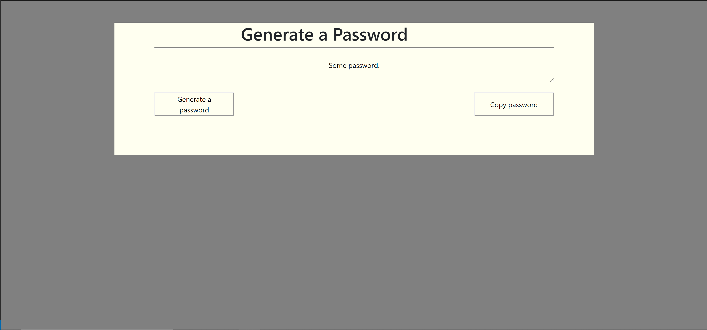

# JavascriptHW1

URL: https://ryanmagill.github.io/JavascriptHW1/

Project will generate a random password with certain specifications entered by the user.

Specifications for password:
8-128 characters long
Special characters
Numeric characters
Lowercase characters
Uppercase characters

User will be prompted to enter length of password when the generate button is pressed. the program will then randomly generate a password.
The user also has to option to copy the password to their clipboard via the copy password button.

